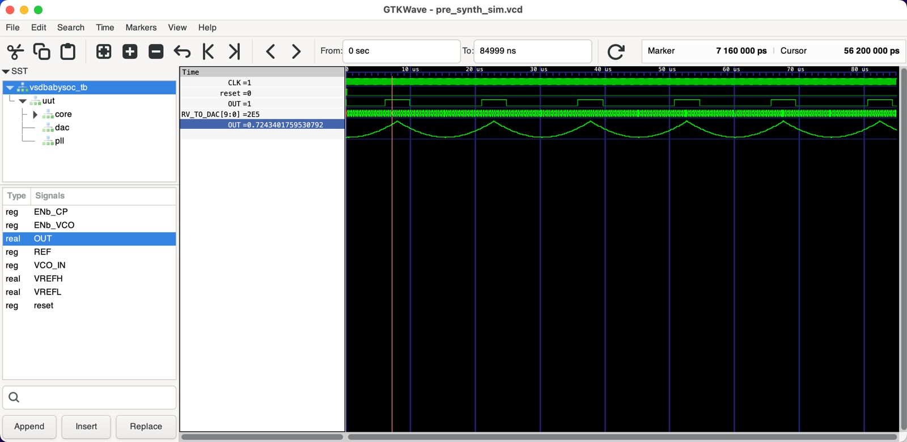

# Week 2: BabySoC Fundamentals & Functional Modelling

## ✅ Objective

The core objective for Week 2 was twofold:

1. Build a solid theoretical understanding of **System-on-Chip (SoC)** design.
2. Gain practical experience in **functional modelling** of the **BabySoC** using simulation tools like **Icarus Verilog** and **GTKWave**.

By the end of the week, the goal was to:

- Explain SoC theory clearly.
- Demonstrate BabySoC's correct functional behavior through simulation waveforms.

---

## 📘 Part 1: Theory – Conceptual Understanding

This section focused on reviewing SoC design notes to build a strong foundation in chip architecture and modeling concepts.

### 🔑 Key Topics Covered:

- **What is an SoC?**  
  Understanding the definition, purpose, and advantages of integrating components into a single chip.

- **Essential SoC Components:**  
  - CPU (Central Processing Unit)  
  - Memory (RAM, ROM, Flash)  
  - Peripherals (I/O interfaces, DACs, etc.)  
  - Interconnects (internal communication buses)

- **The BabySoC Model:**  
  An educational model that simplifies SoC design while preserving the core architectural challenges.

- **Functional Modelling:**  
  The importance of verifying logic and behavior at a high level before moving on to RTL and physical design.

### 📝 Deliverable:

- A 1–2 page write-up summarizing:
  - SoC design fundamentals
  - The role of BabySoC in the learning journey

📄 **[Link to Theoretical Write-up (DOC file)](Week2_Task1.docx)**

---

## 🧪 Part 2: Labs – Hands-on Functional Modelling

This section involved running functional simulations of the BabySoC using Verilog and waveform visualization tools.

### 🛠 Tools Used:

- `iverilog` – Verilog compiler for simulation
- `GTKWave` – Waveform viewer for `.vcd` simulation outputs

### 🧰 Simulation Workflow:

1. **Clone Repository**  
   Download the BabySoC project from the GitHub repository.

2. **Compile Verilog Code**  
   Use `iverilog` to compile the source files.

3. **Run Simulation**  
   Generate waveform data (`.vcd` files) via simulation.

4. **Analyze in GTKWave**  
   Open `.vcd` files to observe signal behavior:
   - Clock signals
   - Reset sequence
   - Data path from processor to DAC

---

## 📦 Deliverables & Outputs

### 📄 Simulation Logs

Include output logs from:
- Compilation (`iverilog`)
- Simulation runs
- Any runtime issues or warnings

---

### 📈 GTKWave Waveform Analysis

#### 🖼️ Waveform 1: Reset, Clocking, and DAC Output

**Explanation:**

- **Clock (`CLK`)**: Periodic signal generated by the PLL; confirms synchronization across the system.
- **Reset (`reset`)**: Transition from active to inactive allows logic circuits to begin functioning.
- **Digital Bus (`RV_TO_DAC[9:0]`)**: Shows output data from the RISC-V core.
- **Analog Output (`OUT`)**: Smooth, step-wise waveform confirms DAC is converting digital data correctly.

---

#### 🖼️ Waveform 2: Dataflow (Processor → DAC)

**Explanation:**

- Zoomed-in view showing the timing relationship between changes in `RV_TO_DAC` and corresponding changes in the DAC's `OUT` signal.
- Verifies that DAC reacts in sync with the processor’s data updates.

---

#### 🖼️ Waveform 3: PLL Control Signals

**Explanation:**

- Displays `ENb_CP` and `ENb_VCO` signals of the PLL module.
- Confirm that the PLL is stable and generating a reliable clock after initialization.

---

## ✅ Conclusion

Week 2 successfully established foundational knowledge in SoC architecture and functional modelling.  
The BabySoC model allowed for practical simulations, giving insight into:

- Internal data flow
- Timing synchronization
- Clock and reset mechanisms

This hands-on approach set the stage for deeper RTL-level design and implementation in future weeks.
